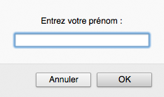
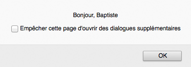

# Jouez avec les variables

Vous savez maintenant utiliser JavaScript pour afficher des valeurs.  Mais pour qu'un programme soit véritablement utile, il faut qu'il puisse mémoriser des données, par exemple des informations saisies par un utilisateur. C'est l'objet de ce chapitre.

## TL;DR

* Une **variable** est une zone de stockage d'information. Chaque variable possède un **nom**, une **valeur** et un **type**. En JavaScript, le type d'une variable est déduit implicitement de sa valeur, et non pas défini explicitement. Il s'agit d'un langage à typage **dynamique**.

* On déclare une variable JavaScript avec le mot-clé `let` suivi du nom de la variable. Si la valeur initiale d'une variable n'est pas destinée à changer, on utilise de préférence le mot-clé `const` pour déclarer une variable **constante**.

* L'opérateur d'affectation `=` permet de donner une valeur à une variable. Dans le cas d'une variable de type nombre, on peut utiliser les opérateurs `+=` et `++` pour incrémenter (augmenter de 1) sa valeur.

* La **portée** (*scope*) d'une variable représente la portion du code source dans laquelle cette variable est utilisable. Les variables définies avec `let` et `const` ont une portée de type bloc : elles ne sont utilisables qu'à l'intérieur du **bloc de code** dans lequel elles sont définies. Un bloc de code est délimité par une paire d'accolades ouvrante et fermante.

* Une **expression** est un morceau de code combinant des variables, des valeurs et des opérateurs. L'évaluation d'une expression produit une valeur et correspond à un certain type.

* On peut inclure des expressions dans une chaîne de caractères délimitée par une paire d'accents graves seuls (\`) et appelée *template literal*.

* Des **conversions de types** peuvent avoir lieu implicitement lors de l'évaluation d'une expression, ou bien explicitement avec les instructions `Number()` et `String()` qui convertissement respectivement une expression en un nombre et en une chaîne.

* Les instructions `prompt()` et `alert()` permettent respectivement de faire saisir et d'afficher une information sous la forme d'une boîte de dialogue.

* Il est essentiel de bien nommer ses variables et d'adopter une convention de nommage, comme par exemple *camelCase*.

## La notion de variable

### Rôle des variables

Un programme informatique mémorise des données en utilisant des variables. Une **variable** est une zone de stockage d'information. On peut l'imaginer comme une boîte dans laquelle on range des choses.

### Propriétés d'une variable

Une variable possède trois grandes propriétés :

* Son **nom**, qui permet de l'identifier. Un nom de variable peut contenir des lettres majuscules ou minuscules, des chiffres (sauf en première position) et certains caractères comme le dollar (`$`)  ou le tiret bas, appelé underscore (`_`).
* Sa **valeur**, qui est la donnée actuellement mémorisée dans cette variable.
* Son **type**, qui détermine le rôle et les opérations applicables à cette variable.

I> JavaScript n'impose pas de définir le type d'une variable. Ce type est déduit de la valeur stockée dans la variable, et peut donc changer au fur et à mesure de l'exécution du programme : on dit que JavaScript est un langage à typage **dynamique**. D'autres langages comme C ou Java imposent la définition du type des variables. On parle alors de typage **statique**.

### Déclarer une variable

Avant de pouvoir stocker des informations dans une variable, il faut la créer. Cette opération s'appelle la **déclaration** de la variable. Au niveau de l'ordinateur, déclarer une variable déclenche la réservation d'une zone de la mémoire attribuée à cette variable. Le programme peut ensuite lire ou écrire des données dans cette zone mémoire en manipulant la variable.

Voici un exemple de code qui déclare une variable puis affiche sa valeur.

```javascript
let a;
console.log(a);
```

En JavaScript, on déclare une variable à l'aide du mot-clé `let` suivi du nom de la variable. Dans cet exemple, la variable créée se nomme `a`.

I> Dans les versions précédentes du langage, on déclarait une variable avec le mot-clé `var`.

Voici le résultat produit par l'exécution de ce programme.


On constate que le résultat affiché est `undefined`. Il s'agit d'un type JavaScript qui indique l'absence de valeur. Immédiatement après sa déclaration, une variable JavaScript n'a pas de valeur, ce qui est logique.

### Affecter une valeur à une variable

Au cours du déroulement du programme, la valeur stockée dans une variable peut changer. Pour donner une nouvelle valeur à une variable, on utilise l'opérateur `=`, appelé **opérateur d'affectation**.

```javascript
let a;
a = 3.14;
console.log(a);
```

Le résultat de son exécution est le suivant.


La valeur de la variable `a` été modifiée par l'opération d'affectation. La ligne `a = 3.14` se lit "a reçoit la valeur 3,14".

W> Attention à ne pas confondre l'opérateur d'affectation `=` avec l'égalité mathématique ! Nous verrons prochainement comment exprimer une égalité en JavaScript.

On peut également combiner déclaration et affectation d'une valeur en une seule ligne. Il est cependant important de bien distinguer leurs rôles respectifs. Le programme ci-dessous est strictement équivalent au précédent.

```javascript
let a = 3.14;
console.log(a);
```

### Déclarer une variable constante

Si la valeur initiale d'une variable ne changera jamais au cours de l'exécution du programme, cette variable est ce qu'on appelle une **constante**. Il vaut alors mieux la déclarer avec le mot-clé `const` plutôt qu'avec `let`. Cela rend le programme plus facile à comprendre, et cela permet aussi de détecter des erreurs.

```javascript
const a = 3.14; // La valeur de a ne pourra plus évoluer
a = 6.28; // Impossible !
```


### Incrémenter une variable de type nombre

Il est également possible d'augmenter ou de diminuer la valeur d'un nombre avec les opérateurs `+=` et `++`. Ce dernier est appelé opérateur d'**incrémentation**, car il permet d'incrémenter (augmenter de 1) la valeur d'une variable.

Dans l'exemple suivant, les lignes 2 et 3 permettent chacune d'augmenter la valeur de la variable `b` de 1.

```javascript
let b = 0; // b contient la valeur 0
b += 1; // b contient la valeur 1
b++; // b contient la valeur 2
console.log(b); // Affiche 2
```

### Portée d'une variable

On appelle **portée** (*scope*) d'une variable la portion du code source dans laquelle cette variable est visible et donc utilisable. Les variables déclarées avec `let` et `const` ont une portée de type bloc : elles ne sont visibles qu'au sein du bloc de code dans lequel elles sont déclarées (ainsi que dans tous les sous-blocs éventuels). En JavaScript et dans de nombreux autres langages, un **bloc de code** est délimité par une paire d'accolades ouvrante et fermante. Un programme JavaScript correspond par défaut à un unique bloc de code.

```javascript
let var1 = 0;
{
    var1 = 1; // OK : var1 est déclarée dans le bloc parent
    const var2 = 0;
}
console.log(var1); // OK : var1 est déclarée dans le bloc courant
console.log(var2); // Erreur : var2 n'est pas visible ici
```

## La notion d'expression

Une **expression** est un morceau de code qui produit une valeur. On crée une expression en combinant des variables, des valeurs et des opérateurs. Toute expression produit une valeur et correspond à un certain type. Le calcul de la valeur d'une expression s'appelle **l'évaluation**. Lors de l'évaluation d'une expression, les variables sont remplacées par leur valeur.

```javascript
// 3 est une expression dont la valeur est le nombre 3
const c = 3;
// c est une expression dont la valeur est celle de c (ici 3)
let d = c;
// (d + 1) est une expression. Sa valeur est celle de d augmentée de 1 (ici 4)
d = d + 1; // d contient la valeur 4
console.log(d); // Affiche 4
```

Une expression peut comporter des parenthèses qui modifient la priorité des opérations lors de l'évaluation. En l'absence de parenthèses, la priorité des opérateurs est la même qu'en mathématiques.

```javascript
let e = 3 + 2 * 4; // e contient la valeur 11
e = (3 + 2) * 4; // e contient la valeur 20
```

Le langage JavaScript permet d'inclure des expressions dans une chaîne de caractères lorsque cette chaîne est délimitée par une paire d'accents graves seuls ou *backticks* (\`). Une telle chaîne est appelée un *template literal* ou littéral de gabarit. A l'intérieur, les expressions sont indiquées par la syntaxe `${expression}`.

On utilise souvent cette possibilité pour créer des chaînes intégrant des valeurs de variables.

```javascript
const pays = "France";
console.log(`J'habite en ${pays}`); // Affiche "J'habite en France"
const x = 3;
const y = 7;
console.log(`${x} + ${y} = ${x + y}`); // Affiche "3 + 7 = 10"
```

## Conversions de types

L'évaluation d'une expression peut entraîner des conversions de type. Ces conversions sont dites **implicites** : elles sont faites automatiquement, sans intervention du programmeur. Par exemple, l'utilisation de l'opérateur `+` entre une valeur de type chaîne et une valeur de type nombre provoque la concaténation des deux valeurs dans un résultat de type chaîne.

```javascript
const f = 100;
// Affiche "La variable f contient la valeur 100"
console.log("La variable f contient la valeur " + f);
```

Le langage JavaScript est extrêmement tolérant au niveau des conversions de type. Cependant, il se peut qu'aucune conversion ne soit possible. En cas d'échec de la conversion d'un nombre, la valeur du résultat est `NaN` (*Not a Number*).

```javascript
const g = "cinq" * 2;
console.log(g); // Affiche NaN
```

Il arrive parfois que l'on souhaite forcer la conversion d'une valeur dans un autre type. On parle alors de conversion **explicite**. Pour cela, JavaScript dispose des instructions `Number()` et `String()` qui convertissent respectivement en un nombre et une chaîne la valeur placée entre parenthèses.

```javascript
const h = "5";
console.log(h + 1); // Concaténation : affiche la chaîne "51"
const i = Number("5");
console.log(i + 1); // Addition numérique : affiche le nombre 6
```

## Interactions avec l'utilisateur

### Saisie et affichage à l'écran

Maintenant que nous savons utiliser des variables, nous pouvons écrire des programmes qui échangent des informations avec l'utilisateur.

```javascript
const prenom = prompt("Entrez votre prénom :");
alert(`Bonjour, ${prenom}`);
```

A l'exécution, une première boîte de dialogue apparaît pour demander la saisie du prénom.



Cette boîte est le résultat de l'exécution de l'instruction JavaScript `prompt("Entrez votre prénom :")`.

Après saisie du prénom, une seconde boîte affiche un "bonjour" personnalisé.



La valeur saisie dans la première boîte de dialogue a été stockée dans une variable de type chaîne nommée `prenom`. Ensuite, l'instruction JavaScript `alert()` a déclenché l'affichage de la seconde boîte, contenant le message d'accueil.

### Affichege dans la console

Nous avons vu dans le précédent chapitre que l'instruction JavaScript `console.log()` permettait d'afficher une information.

I> On désigne par "console" une zone d'informations textuelles. L'instruction `console.log()` ne fait pas à proprement parler partie de la spécification du langage JavaScript. Cependant, la très grande majorité des environnements JavaScript, et notamment les navigateurs web, disposent d'une console dans laquelle il est possible d'afficher des informations.

On peut donc utiliser soit `console.log()`, soit `alert()` pour afficher des informations à l'utilisateur. Contrairement à `alert()`, `console.log()` ne bloque pas l'exécution du programme, ce qui en fait parfois un meilleur choix.

Il est possible d'utiliser `console.log()` pour afficher plusieurs valeurs simultanément, en les séparant par des virgules.

```javascript
const temp1 = 36.9;
const temp2 = 37.6;
const temp3 = 37.1;
console.log(temp1, temp2, temp3); // Affiche "36.9 37.6 37.1"
```

### Saisie d'un nombre

Quel que soit le texte saisi, l'instruction `prompt()` renvoie toujours une valeur de type chaîne. Il faudra penser à convertir cette valeur avec l'instruction `Number()` si vous souhaitez ensuite la comparer à d'autres nombres ou l'utiliser dans des expressions mathématiques.

```javascript
const saisie = prompt("Entrez un nombre : "); // saisie est de type chaîne
const nb = Number(saisie); // nb est de type nombre
```

Il est possible de combiner les deux opérations (saisie et conversion) en une seule ligne de code, pour un résultat identique :

```javascript
const nb = Number(prompt("Entrez un nombre : ")); // nb est de type nombre
```

Ici, le résultat de la saisie utilisateur est directement converti en une valeur de type nombre par l'instruction `Number()` et affecté à la variable `nb`.

## Importance du nommage des variables

Pour clore ce chapitre, j'aimerais insister sur un aspect parfois négligé par les développeurs débutants : le nommage des variables. Le nom choisi pour une variable n'a pour la machine aucune importance, et le programme fonctionnera de manière identique. Rien n'empêche de nommer toutes ses variables `a`, `b`, `c`...,  voire de choisir des noms absurdes comme `steackhache` ou `jesuisuncodeurfou`.

Et pourtant, la manière dont sont nommées les variables affecte grandement la facilité de compréhension d'un programme. Observez ces deux versions du même exemple.

```javascript
const nb1 = 5.5;
const nb2 = 3.14;
const nb3 = 2 * nb2 * nb1;
console.log(nb3);
```

```javascript
const rayon = 5.5;
const pi = 3.14;
const perimetre = 2 * pi * rayon;
console.log(perimetre);
```

Leur fonctionnement est strictement identique, et pourtant la compréhension du second est beaucoup plus rapide grâce aux noms choisis pour ses variables.

Comment faire pour bien nommer les variables de ses programmes ?

### Choisir des noms significatifs

La règle la plus importante est de donner à toute variable un nom qui reflète son rôle. C'est bien le cas dans le second exemple ci-dessus : les variables `rayon`, `pi` et `perimetre` stockent respectivement le rayon d'un cercle, la valeur du nombre PI et le périmètre calculé.‌

### Bannir les caractères accentués

Les caractères accentués comme `é` ou `à` sont mal supportés dans certains environnements et sont inconnus du monde anglophone. Mieux vaut les éviter : on nommera une variable `perimetre` plutôt que `périmètre`.

### Ne pas utiliser les noms réservés du langage

Les mots-clés du langage JavaScript sont des noms réservés. Ils ne doivent pas être utilisés comme noms de variables. Vous trouverez sur [cette page](https://developer.mozilla.org/fr/docs/Web/JavaScript/Reference/Mots_r%C3%A9serv%C3%A9s) la liste des noms réservés de JavaScript.

### Adopter une convention de nommage

Il faut parfois plusieurs mots pour décrire le rôle de certaines variables. Dans ce cas, on a intérêt à adopter une **convention de nommage**, c'est-à-dire une manière uniforme d'écrire les noms de toutes les variables. Il en existe plusieurs. Dans ce cours, nous allons adopter la plus fréquemment utilisée : la norme [camelCase](https://fr.wikipedia.org/wiki/CamelCase) (appelée parfois *lowerCamelCase*). Elle repose sur deux grands principes :

* Tout nom de variable commence par une **lettre minuscule**.
* Si le nom d'une variable se compose de plusieurs mots, la première lettre de chaque mot (sauf le premier) s'écrit en **majuscule**.

Par exemple, les noms `montantTravauxMaison` et `codeClientSuivant` respectent la norme *camelCase*.

W> Comme de nombreux langages, JavaScript fait la distinction entre majuscules et minuscules. On dit qu'il est **sensible à la casse** (*case sensitive*). Par exemple, `mavariable` et `maVariable` seront considérées comme deux variables différentes. Attention aux étourderies !

## À vous de jouer !

Cherchez les exercices ci-dessous en faisant l'effort de bien nommer toutes vos variables.

### Bonjour amélioré ([résultat à obtenir](http://codepen.io/bpesquet/pen/zNYRGJ?editors=1102))

Modifiez le programme créé au chapitre précédent afin qu'il fasse saisir et affiche le nom de l'utilisateur en plus de son prénom de l'utilisateur. Attention à bien respecter les espaces entre les mots dans le message final.

### Valeurs finales

Observez le programme suivant et tentez de prévoir les valeurs finales de chaque variable.

```javascript
let a = 2;
a = a - 1;
a++;
let b = 8;
b += 2;
const c = a + b * b;
const d = a * b + b;
const e = a * (b + b);
const f = a * b / a;
const g = b / a * a;
console.log(a, b, c, d, e, f, g);
```

Vérifiez ensuite vos prévisions en l'exécutant.

### Calcul de TVA ([résultat à obtenir](http://codepen.io/bpesquet/pen/XpWZmP?editors=1102))

Ecrivez un programme qui fait saisir un prix hors taxes à l'utilisateur, puis qui affiche le prix TTC correspondant en se basant sur un taux de TVA à 20,6%.

### Conversion Celsius/Fahrenheit ([résultat à obtenir](http://codepen.io/bpesquet/pen/vgYdGE?editors=1102))

Ecrivez un programme qui fait saisir une température en degrés Celsius, puis affiche le résultat de sa conversion en degrés Fahrenheit. Rappel : en informatique, la virgule s'écrit avec un point.

> "C'est à Daniel Gabriel Fahrenheit que l'on doit l'invention des thermomètres en graduation Fahrenheit. Au début, ses thermomètres sont à l'alcool (1709), mais il remplace rapidement l'alcool par du mercure (1715), permettant à ses outils de mesure de fournir des données comparables. En 1742, un autre scientifique, Anders Celsius, propose une nouvelle graduation au thermomètre. La conversion entre les échelles est donnée par [°F] = [°C] x 9/5 + 32."

### Permutation de deux variables ([résultat à obtenir](http://codepen.io/bpesquet/pen/aBeoPB?editors=1102))

Ecrivez un programme ayant initialement le contenu suivant.

```javascript
let nombre1 = 5;
let nombre2 = 3;

// Tapez votre code à cet endroit (sans rien modifier d'autre !)

console.log(nombre1); // Doit afficher 3
console.log(nombre2); // Doit afficher 5
```

A l'endroit indiqué par le commentaire, ajoutez le code nécessaire pour inverser les valeurs des deux variables.

I> Il existe plusieurs solutions à cet exercice. Astuce : vous n'êtes pas limité(e) à l'utilisation de deux variables.
