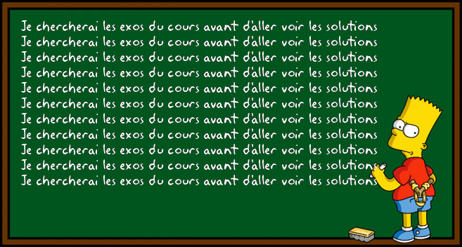

# Répétez des instructions

L'objectif de ce chapitre est d'apprendre comment ajouter à nos programmes des possibilités
d'exécution répétitive.

## TL;DR

* On utilise une **boucle**  afin d'exécuter plusieurs fois un bloc d'instructions. Chaque exécution est appelée un **tour de boucle** ou une **itération**. Le bloc d'instructions associé à une boucle est appelé le **corps de la boucle**.
* La boucle `while` permet de répéter des instructions tant qu'une condition est vérifiée. La boucle `for` ajoute la possibilité d'effectuer un traitement à l'entrée dans la boucle (initialisation) et après chaque tour de boucle (étape).
* La variable utilisée dans l'initialisation, la condition et l'étape d'une boucle `for` est appelée le **compteur** de la boucle.
* Il faut toujours que la condition d'une boucle `while` puisse devenir fausse afin d'éviter le risque d'une **boucle infinie**.
* On s'interdit de manipuler le compteur d'une boucle `for` à l'intérieur du corps de la boucle.
* Toutes les boucles peuvent s'écrire avec un `while`. La boucle `for` est à privilégier lorsque le nombre d'itérations est connu à l'avance.

## Introduction

Essayons de créer un programme qui affiche tous les nombres entre 1 et 5. Voici ce que nous pouvons écrire avec nos connaissances actuelles.

```javascript
console.log(1);
console.log(2);
console.log(3);
console.log(4);
console.log(5);
```

Même s'il reste relativement court, ce programme est très répétitif. Que se passerait-il si nous devions afficher non pas 5, mais 100 ou même 1000 nombres ? On doit pouvoir faire mieux.

Pour cela, le langage JavaScript offre la possibilité de répéter l'exécution d'un ensemble d'instructions en plaçant ces instructions à l'intérieur d'une **boucle**. Le nombre de répétitions peut être connu à l'avance ou dépendre de l'évaluation d'une condition. A chaque répétition, les instructions contenues dans la boucle sont exécutées. C'est ce qu'on appelle un **tour de boucle** ou encore une **itération**.



Nous allons étudier les deux grands types de boucles utilisables en JavaScript ainsi que dans la plupart des autres langages de programmation.

## La boucle `while`

La boucle `while` permet de répéter des instructions **tant qu'une condition est vérifiée**.

### Exemple d'utilisation

Voici notre programme d'exemple réécrit avec une boucle while.

```javascript
let nombre = 1;
while (nombre <= 5) {
    console.log(nombre);
    nombre++;
}
```

Exactement comme le précédent, il affiche les nombres entre 1 et 5 dans la console.


### Fonctionnement

La syntaxe de l'instruction `while` est la suivante.

```javascript
while (condition) {
    // instructions exécutées tant que la condition est vérifiée
}
```

Avant chaque tour de boucle, la condition associée au `while` est évaluée.

* Si elle est vraie, les instructions du bloc de code associé au `while` sont exécutées. Ensuite, l'exécution revient au niveau du `while` et la condition est à nouveau vérifiée.

* Si elle est fausse, les instructions du bloc ne sont pas exécutées et le programme continue juste après le bloc `while`.

Le bloc d'instructions associé à une boucle est appelé le **corps de la boucle**.

W> Le corps de la boucle doit être placé entre accolades, sauf s'il se réduit à une seule instruction. Dans un premier temps, je vous conseille d'ajouter systématiquement des accolades à toutes vos boucles.

Dans l'exemple précédent, la valeur du la variable `nombre` est affichée tant que cette valeur ne dépasse pas 5. Lorsque c'est le cas, la boucle `while` se termine.

## La boucle `for`

On a fréquemment besoin d'écrire des boucles dont la condition est basée sur la valeur d'une variable qui est modifiée dans le corps de la boucle, comme dans notre exemple précédent. Pour répondre à ce besoin, JavaScript et la plupart des autres langages disposent d'un autre type de boucle : le `for`.

### Exemple d'utilisation

Voici notre programme d'exemple réécrit avec une boucle `for`.

```javascript
let nombre;
for (nombre = 1; nombre <= 5; nombre++) {
    console.log(nombre);
}
```

Cet exemple donne exactement le même résultat que les précédents.

### Fonctionnement

La syntaxe de l'instruction `for` est la suivante.

```javascript
for (initialisation; condition; étape) {
    // instruction executées tant que la condition est vérifiée
}
```

Son fonctionnement est un peu plus complexe que celui d'un `while`. Lisez attentivement ce qui suit :

* L'**initialisation** se produit une seule fois, au début de l'exécution.

* La **condition** est évaluée *avant* chaque tour de boucle. Si elle est vraie, un nouveau tour de boucle est effectué. Sinon, la boucle est terminée.

* L'**étape**  est réalisée *après* chaque tour de boucle.

Le plus souvent, on utilise l'initialisation pour définir la valeur initiale d'une variable qui sera impliquée dans la condition de la boucle. L'étape sert à modifier la valeur de cette variable.

Dans l'exemple précédent, l'initialisation définit la valeur initiale de la variable `nombre`. La condition permet de rester dans la boucle tant que `nombre` est inférieur ou égal à 5. l'étape incrémente `nombre` de 1 après que le corps de la boucle ait affiché la valeur de cette variable.

### Compteur de boucle

La variable utilisée dans l'initialisation, la condition et l'étape d'une boucle `for` est appelée le **compteur** de la boucle.

I> Par convention, la variable compteur d'une boucle for est souvent nommée `i`.

Très souvent,  on n'a pas besoin d'utiliser la variable compteur en dehors du corps de la boucle. Dans ce cas, on peut la déclarer en même temps qu'on l'initialise dans la boucle. Notre programme d'exemple peut être réécrit ainsi :

```javascript
for (let nombre = 1; nombre <= 5; nombre++) {
    console.log(nombre);
}
```

## Erreurs fréquentes

### Boucle `while` infinie

Le principal risque lié à la boucle while est la "boucle infinie". Il s'agit d'une erreur de programmation très facile à commettre, donc dangereuse.

Voici l'exemple de boucle `while` modifié pour oublier volontairement la ligne qui incrémente la variable `nombre`.

```javascript
let nombre = 1;
while (nombre <= 5) {
    console.log(nombre);
    // La variable n'est plus modifiée : la condition restera toujours vraie
}
```

Ce programme affiche indéfiniment le nombre 1. Lors de son exécution, on fait un premier tour de boucle puisque la condition `(nombre <= 5)` est initialement vérifiée. Mais comme on ne modifie plus la variable `nombre` dans le corps de la boucle, la condition reste indéfiniment vraie : il s'agit d'une boucle infinie.

Pour éviter d'écrire par mégarde une boucle infinie, il faut s'assurer que la variable impliquée dans la condition puisse être modifiée dans le corps de la boucle.

### Manipulation du compteur d'une boucle `for`

Imaginons qu'une inspiration bizarre vous conduise à modifier le compteur d'une boucle `for` dans le corps de la boucle, comme dans l'exemple suivant.

```javascript
for (let i = 1; i <= 5; i++) {
    console.log(i);
    i++; // La variable i est modifiée dans le corps de la boucle
}
```

L'exécution de cet exemple produit le résultat suivant.


A chaque tour de boucle, la variable `i` est incrémentée deux fois : dans le corps de la boucle, puis dans l'étape exécutée à la fin de chaque tour.

Quand on emploie une boucle `for`, la modification du compteur de boucle (le plus souvent une incrémentation) est réalisée à la fin de chaque tour de boucle. Sauf exception rarissime, Il ne faut surtout pas modifier le compteur dans le corps de la boucle.

## Choix entre un `while` et un `for`

Comment choisir le type de boucle à utiliser lorsqu'on doit répéter des instructions dans un programme ?

La boucle `for` a l'avantage d'intégrer la modification du compteur dans sa syntaxe, ce qui élimine le problème des boucles infinies. En revanche, son utilisation implique que le nombre de tours de boucle soit connu à l'avance. Les scénarios où le nombre de tours ne peut pas être prévu à l'avance seront plus simples à écrire avec un `while`. C'est notamment le cas lorsque la boucle sert à contrôler une donnée saisie par l'utilisateur, comme dans cet exemple.

```javascript
let lettre = "";
while (lettre !== "X") {
    lettre = prompt("Tapez une lettre ou X pour sortir :");
}
```

Ce programme demande à l'utilisateur de saisir une lettre jusqu'à ce qu'il tape "X". Le nombre de tours de boucle dépend de vos saisies : il est imprévisible.

Voici le même programme, écrit avec un `for`.

```javascript
let lettre = "";
for (; lettre !== "X";) {
    lettre = prompt("Tapez une lettre ou X pour sortir :");
}
```

On utilise uniquement la condition de sortie et pas l'initialisation ni l'étape : autant choisir la boucle `while`.

En conclusion, le choix entre un `while` et un `for` dépend du contexte. Toutes les boucles peuvent s'écrire avec un `while`. Si on peut prévoir à l'avance le nombre de tours de boucles à effectuer, la boucle `for` est le meilleur choix. Sinon, il vaut mieux utiliser le `while`.

## A vous de jouer !

Voici venu le moment des exercices d'application. Les consignes habituelles s'appliquent : nommage des variables, indentation, test exhaustif pour trouver d'éventuelles erreurs.

Je vous conseille de réaliser chaque exercice avec le `while`, puis avec le `for`. Cela vous entraînera et vous permettra de mieux juger par la suite du meilleur type de boucle à utiliser.

### Tournez manège ([résultat à obtenir](http://codepen.io/bpesquet/pen/GrRwQx?editors=1102))

Ecrivez un programme qui fait faire 10 tours de manège en affichant un message à chaque tour.

Ensuite, améliorez votre programme pour que le nombre de tours soit saisi par l'utilisateur.

### Parité ([résultat à obtenir](http://codepen.io/bpesquet/pen/xgxQJg?editors=1102))

Examinez le programme ci-dessous qui affiche les nombres pairs (divisibles par 2) jusqu'à 10.

```javascript
for (let i = 1; i <= 10; i++) {
    if (i % 2 === 0) {
        console.log(`${i} est pair`);
    }
}
```

Il utilise l'opérateur modulo `%`, qui calcule le reste de la division entière d'un nombre par un autre. Si le résultat du modulo d'un nombre par 2 est 0, alors ce nombre est pair. Voici quelques exemples d'utilisation de cet opérateur.

```javascript
console.log(10 % 2); // Affiche 0 car 10 = 5 * 2 + 0
console.log(11 % 2); // Affiche 1 car 11 = 5 * 2 + 1
console.log(18 % 3); // Affiche 0 car 18 = 3 * 6 + 0
console.log(19 % 3); // Affiche 1 car 19 = 3 * 6 + 1
console.log(20 % 3); // Affiche 2 car 20 = 3 * 6 + 2
```

Modifiez le programme initial pour qu'il affiche aussi les nombres impairs.

Ensuite, améliorez le programme pour que le nombre de départ soit saisi par l'utilisateur.

W> Le programme ne doit afficher que 10 nombres (y compris celui saisi) et non 11.

### Contrôle de saisie ([résultat à obtenir](http://codepen.io/bpesquet/pen/WRNPQp?editors=1102))

Ecrivez un programme qui fait saisir un nombre à l'utilisateur jusqu'à ce que ce nombre soit inférieur ou égal à 100.

Ensuite, améliorez votre programme pour que le nombre saisi soit compris entre 50 et 100.

I> Réfléchissez bien à la condition de votre boucle : quel est l'inverse de "compris entre 50 et 100" ?

### Table de multiplication ([résultat à obtenir](http://codepen.io/bpesquet/pen/PWoVzN?editors=1102))

Ecrivez un programme qui fait saisir un nombre à l'utilisateur, puis affiche la table de multiplication de ce nombre.

Ensuite, améliorez votre programme pour vérifier que le nombre saisi soit compris entre 2 et 9, en vous inspirant de l'exercice précédent.

### Ni oui ni non ([résultat à obtenir](http://codepen.io/bpesquet/pen/JEjxbz?editors=1102))

Ecrivez un programme qui fait jouer l'utilisateur au ni oui, ni non : il entre un texte jusqu'à saisir "oui" ou "non", ce qui déclenche la fin du jeu.

### Triangle ([résultat à obtenir](http://codepen.io/bpesquet/pen/VPwgpw?editors=1102))

Ecrivez un programme qui construit progressivement un triangle de 7 lignes.

### FizzBuzz ([résultat à obtenir](http://codepen.io/bpesquet/pen/VPwgNj?editors=1102))

Ecrivez un programme qui affiche tous les nombres entre 1 et 100 avec les exceptions suivantes :

* Il affiche `"Fizz"` à la place du nombre si celui-ci est divisible par 3.

* Il affiche `"Buzz"` à la place du nombre si celui-ci est divisible par 5 et non par 3.

Ensuite, améliorez votre programme pour qu'il affiche `"FizzBuzz"` à la place des nombres divisibles à la fois par 3 et par 5.

I> Cet exercice a de [nombreuses solutions possibles](http://www.tomdalling.com/blog/software-design/fizzbuzz-in-too-much-detail/) et constitue un [test d'entretien d'embauche classique](http://imranontech.com/2007/01/24/using-fizzbuzz-to-find-developers-who-grok-coding/) qui élimine un nombre *significatif* de candidats. Accrochez-vous pour le réussir !