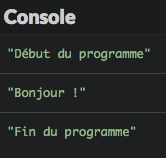

# Modularisez votre code avec les fonctions

Dans ce chapitre, vous allez découvrir comment décomposer un programme en sous-parties appelées des fonctions.

## TL;DR

* Une **fonction** est un regroupement d'instructions qui réalise une tâche donnée. En JavaScript, une fonction est créée à l'aide du mot-clé `function`.
* Ecrire un programme sous forme d'un ensemble de fonctions plutôt qu'en un seul bloc permet de gagner en **lisibilité** et en **modularité**.
* Les variables déclarées dans le corps d'une fonction sont appelées des **variables locales**. Leur portée se limite au corps de la fonction.
* Une fonction peut renvoyer une valeur grâce au mot-clé `return`, ou ne rien renvoyer (on parle alors de **procédure**). Elle peut également accepter ou non des **paramètres**, qui sont les données dont elle a besoin pour fonctionner.
* En JavaScript, la valeur d'une variable peut être une fonction. On peut donc créer une **fonction anonyme** et l'affecter à une variable. Pour cela, il est possible de définir la fonction de manière classique ou d'utiliser la syntaxe dite **fonction fléchée** (*fat arrow*).
* Il est important de créer des fonctions ayant un **rôle** bien défini et de limiter leur complexité. Le **nom** de la fonction, souvent basé sur un verbe à l'infinitif exprimant une **action**, doit réfléter son rôle. JavaScript offre de nombreuses fonctions prédéfinies qui peuvent simplifier la tâche du programmeur.

## Introduction : le rôle des fonctions

Pour comprendre l'intérêt des fonctions, revenons sur notre algorithme de préparation d'un plat de pâtes issu du chapitre d'introduction.

```text
Début
    Sortir une casserole
    Mettre de l'eau dans la casserole
    Mettre la casserole sur le feu
    Tant que l'eau ne bout pas
      Attendre
    Verser les pâtes dans la casserole
    Tant que les pâtes ne sont pas cuites
        Attendre
    Verser les pâtes dans une passoire
    Remuer la passoire pour faire couler l'eau
    Remettre les pâtes dans la casserole
    Goûter
    Tant que les pâtes sont trop fades
        Ajouter du sel
        Goûter
    Si on préfère le beurre à l'huile
        Ajouter du beurre
    Sinon
        Ajouter de l'huile
Fin
```

Voici le même algorithme. écrit d'une manière différente.

```text
Début
    Faire bouillir de l'eau
    Cuire les pâtes dans l'eau
    Egoutter les pâtes
    Assaisonner les pâtes
Fin
```

La première version détaille toutes les actions individuelles à réaliser. La seconde décompose la recette en sous-étapes regroupant plusieurs actions individuelles. Cette version est plus concise et plus facile à interpréter, mais elle introduit des concepts relatifs au domaine de la cuisine comme *cuire*, *égoutter* ou *assaisonner*. On peut envisager de réutiliser ces concepts pour réaliser d'autres recettes, par exemple la préparation d'un plat de riz.

Jusqu'à présent, nos programmes étaient écrits sur le modèle du premier algorithme : des actions individuelles qui s'enchaînent. Vous allez maintenant apprendre à les concevoir sous la forme d'un ensemble de sous-étapes. En JavaScript, ces sous-étapes sont appelées des fonctions.

## Découverte des fonctions

Une **fonction** est un regroupement d'instructions qui réalise une tâche donnée.

Voici un exemple basique utilisant une fonction.

```js
function direBonjour() {
    console.log("Bonjour !");
}

console.log("Début du programme");
direBonjour();
console.log("Fin du programme");
```



Les paragraphes suivants vont permettre d'expliquer ce résultat.

### Déclaration d'une fonction

Observons la première partie du programme d'exemple.

```javascript
function direBonjour() {
    console.log("Bonjour !");
}
```

Cet extrait permet de créer une fonction nommée `direBonjour()`. Elle n'est constituée que d'une seule instruction qui affiche sur la console le message `"Bonjour !"`.

Cet extrait de code constitue la **déclaration** d'une fonction. Voici sa syntaxe.

```js
// Déclaration d'une fonction nommée maFonction
function maFonction() {
    // Instructions de la fonction
}
```

La déclaration d'une fonction s'effectue à l'aide du mot-clé JavaScript `function` suivi du nom de la fonction et d'une paire de parenthèses. Les instructions qui composent la fonction constituent le corps de la fonction. Ces instructions sont placées entre accolades et indentées.

### Appel d'une fonction

Voici la seconde partie de notre programme d'exemple.

```javascript
// ...
console.log("Début du programme");
direBonjour();
console.log("Fin du programme");
```

La première et la troisième instructions affichent des messages dans la console.  La deuxième effectue un **appel** à la fonction `direBonjour()` déclarée plus haut.

L'appel d'une fonction s'effectue en écrivant le nom de la fonction suivi d'une paire de parenthèses.

```js
// ...
maFonction(); // Appel de la fonction maFonction
// ...
```

L'appel d'une fonction déclenche l'exécution des instructions qui la constituent, puis l'exécution reprend à l'endroit où la fonction a été appelée. Ce fonctionnement est illustré par le schéma ci-dessous.


### Avantages des fonctions

Lorsqu'on cherche à résoudre un problème complexe, il est généralement efficace de le décomposer en sous-problèmes plus simples.

Les fonctions permettent d'appliquer ce principe à la création de logiciels : on va décomposer le programme en écrivant plusieurs fonctions, chacune dédiée à un objectif particulier. Le programme fera appel aux fonctions au fur et à mesure de son exécution.

Ecrit sous la forme d'une combinaison de fonctions, le programme sera plus lisible et plus facile à faire évoluer qu'un programme écrit de manière monobloc. De plus, il sera parfois possible de réutiliser certaines fonctions dans d'autres programmes.

Enfin, la création d'une fonction permet de lutter contre la [duplication de code](https://fr.wikipedia.org/wiki/Duplication_de_code) : plutôt que de dupliquer le même code dans un programme, on centralise ce code sous la forme d'une fonction et on y fait appel depuis tous les endroits où c'est nécessaire.

## Possibilités des fonctions

### Valeur de retour

Voici une variante de notre programme d'exemple.

```js
function direBonjour() {
    return "Bonjour !";
}

console.log("Début du programme");
const resultat = direBonjour();
console.log(resultat);
console.log("Fin du programme");
```

Elle produit exactement le même résultat que précédemment.

Dans cet exemple, le corps de la fonction `direBonjour()` a été modifié : l'instruction `console.log(...)` a été remplacée par la ligne `return "Bonjour !"`.

L'utilisation du mot-clé `return` dans une fonction permet de lui donner une **valeur de retour**. Son appel produit un résultat qui correspond à la valeur placée juste après le `return` dans la fonction. Ce résultat peut être récupéré par le programme appelant. Ici, la fonction `direBonjour()` renvoie la valeur chaîne `"Bonjour !"`. Cette valeur est stockée par le programme dans la variable `resultat`, qui est ensuite affichée.

Une fonction incluant une instruction `return` renvoie une valeur de retour lorsqu'elle est appelée : l'expression située immédiatement après lereturn.

```js
// Déclaration d'une fonction nommée maFonction
function maFonction() {
    let valeurRetour;
    // Calcul de la valeur de retour
    // valeurRetour = ...
    return valeurRetour;
}

// Récupération de la valeur de retour de maFonction
const valeur = maFonction();
// ...
```

Cette valeur de retour peut être de n'importe quel type (nombre, chaîne, etc). En revanche, une fonction ne peut renvoyer qu'une seule valeur.

W> Rien n'oblige à récupérer la valeur de retour d'une fonction, mais dans ce cas, cette valeur est "oubliée" par le programme qui appelle la fonction !

Si on essaie de récupérer la valeur de retour d'une fonction qui n'inclut pas d'instruction `return`, on obtient la valeur JavaScript `undefined`.

```js
function maFonction() {
    // ...
    // Pas d'instruction return
}

const resultat = maFonction();
console.log(resultat); // Affiche undefined
```

I> Une fonction qui ne renvoie pas de valeur est parfois appelée une **procédure**.

W> L'exécution de l'instruction `return` renvoie immédiatement vers le programme appelant. Il ne faut jamais ajouter d'instructions après un `return` dans une fonction : elles ne seraient jamais exécutées.

On peut simplifier un peu notre exemple en affichant directement le résultat de l'appel à la fonction `direBonjour()` sans utiliser de variable. Ici, la valeur de retour de `direBonjour()` est directement affichée dans la console.

```js
function direBonjour() {
    return "Bonjour !";
}

console.log(direBonjour()); // Affiche "Bonjour !"
```

### Variables locales

Il est possible de déclarer des variables à l'intérieur d'une fonction, comme dans l'exemple ci-dessous.

```js
function direBonjour() {
    const message = "Bonjour !";
    return message;
}

console.log(direBonjour()); // Affiche "Bonjour !"
```

La fonction `direBonjour()` déclare une variable nommée `message`, puis renvoie sa valeur.

Les variables déclarées dans le corps d'une fonction sont appelées des **variables locales**. En effet, leur portée se limite au corps de la fonction. Ainsi, l'exécution du programme suivant provoquera une erreur.

```js
function direBonjour() {
    const message = "Bonjour !";
    return message;
}

console.log(direBonjour()); // Affiche "Bonjour !"
console.log(message); // Erreur : la variable message n'existe pas ici
```

A chaque appel d'une fonction qui déclare des variables locales, ces variables sont recréées. On peut donc appeler plusieurs fois la même fonction, et chaque appel sera parfaitement indépendant des autres.

Ne pas pouvoir utiliser de variables locales en dehors des fonctions où elles sont déclarées peut sembler une limitation. C'est au contraire un double avantage :

* Une fonction peut être conçue comme une entité autonome et réutilisable.

* Un programme peut déclarer ses propres variables et utiliser autant de fonctions que nécessaire, sans se préoccuper des variables locales qui y sont déclarées.

### Passage de paramètres

Un **paramètre** est une information dont une fonction a besoin pour jouer son rôle. Les paramètres d'une fonction sont définis entre parenthèses juste après le nom de la fonction. On peut ensuite utiliser leur valeur dans le corps de la fonction.

La valeur d'un paramètre est fournie au moment de l'appel de la fonction : on dit que cette valeur est **passée en paramètre**. On appelle **argument** la valeur donnée à un paramètre lors d'un appel.

Modifions notre exemple pour construire un message de bienvenue personnalisé.

```js
function direBonjour(prenom) {
    const message = `Bonjour, ${prenom} !`;
    return message;
}

console.log(direBonjour("Baptiste")); // Affiche "Bonjour, Baptiste !"
console.log(direBonjour("Sophie"));   // Affiche "Bonjour, Sophie !"
```

La déclaration de la fonction ‌`direBonjour()` a été modifiée : elle contient à présent un paramètre nommé `prenom`.

Dans cet exemple, le premier appel à la fonction `direBonjour()` est fait avec l'argument `"Baptiste"` et le second avec l'argument `"Sophie"`. Dans le premier cas, le paramètre `prenom` reçoit la valeur `"Baptiste"` et dans le second, la valeur `"Sophie"`.

Les paramètres d'une fonction sont parfois appelés des paramètres formels et les arguments des paramètres effectifs. Pour des raisons de simplicité, je préfère employer les termes de paramètre et d'argument.

Voici la syntaxe générale de la déclaration d'une fonction acceptant des paramètres. Leur nombre n'est pas limité, mais il est rarement nécessaire de dépasser 3 ou 4 paramètres.

```js
// Déclaration de la fonction maFonction
function maFonction(param1, param2, ...) {
    // Instructions pouvant utiliser param1, param2, ...
}

// Appel de la fonction maFonction
// param1 reçoit la valeur de arg1, param2 la valeur de arg2, ...
maFonction(arg1, arg2, ...);
```

Lors d'un appel à une fonction acceptant des paramètres, le nombre et l'ordre des paramètres doivent être respectés. Observez l'exemple suivant et le résultat de son exécution.

```js
function presentation(prenom, age) {
    console.log(`Tu t'appelles ${prenom} et tu as ${age} ans`);
}

presentation("Garance", 9); // Affiche "Tu t'appelles Garance et tu as 9 ans"
presentation(5, "Prosper"); // Affiche "Tu t'appelles 5 et tu as Prosper ans"
```

Lors du second appel, les valeurs données aux paramètres sont inversées : `prenom` reçoit la valeur `3` et `age` reçoit la valeur `"Prosper"`.

## Fonctions anonymes

Il existe d'autres manières de créer des fonctions en JavaScript. En voici un exemple.

```js
const bonjour = function(prenom) {
    const message = `Bonjour, ${prenom} !`;
    return message;
}

console.log(bonjour("Thomas")); // Affiche "Bonjour, Thomas !"
```

La fonction créée ci-dessus est **anonyme** et directement affectée à la variable `bonjour`. La valeur de cette variable est donc une fonction.

La syntaxe pour créer une fonction anonyme est la suivante.

```js
// Affection d'une fonction anonyme à la variable maVariable
const maVariable = function(param1, param2, ...) {
    // Instructions pouvant utiliser param1, param2, ...
}

// Appel de la fonction anonyme
// param1 reçoit la valeur de arg1, param2 la valeur de arg2, ...
maVariable(arg1, arg2, ...);
```

Les dernières évolutions du langage JavaScript ont introduit une syntaxe plus concise pour créer des fonctions anonymes. L'exemple suivant est strictement équivalent au précédent.

```js
const bonjour = (prenom) => {
    const message = `Bonjour, ${prenom} !`;
    return message;
}

console.log(bonjour("Thomas")); // Affiche "Bonjour, Thomas !"
```

Cette syntaxe est appelée **fonction fléchée** (*fat arrow*).

```js
// Affection d'une fonction anonyme à la variable maVariable
const maVariable = (param1, param2, ...)  => {
    // Instructions pouvant utiliser param1, param2, ...
}

// Appel de la fonction anonyme
// param1 reçoit la valeur de arg1, param2 la valeur de arg2, ...
maVariable(arg1, arg2, ...);
```

Nous reviendrons plus loin sur les utilisations possibles des fonctions anonymes et les nombreuses possibilités offertes par les fonctions en JavaScript.

## Comment (bien) programmer avec les fonctions

### Créer des fonctions à bon escient

Une fonction peut utiliser les mêmes éléments qu'un programme classique : variables, conditions, boucles, etc. Une fonction peut même faire appel à une autre fonction, ce qui ouvre des possibilités infinies pour construire nos programmes.

Il convient toutefois de rester raisonnable et de ne pas multiplier artificiellement le nombre de fonctions d'un programme, sous peine de compliquer sérieusement sa compréhension. Il vaut mieux essayer de créer des fonctions ayant chacune un rôle bien défini et minimiser les interdépendances entre fonctions.

### Utiliser les fonctions prédéfinies de JavaScript

Sans les nommer ainsi, nous avons déjà utilisé plusieurs fonctions prédéfinies de JavaScript comme `prompt()` ou `alert()`. Le langage vous propose un nombre important de fonctions qui répondent à des besoins variés. En programmation comme ailleurs, il est rarement utile de réinventer la roue et il est important de privilégier l'utilisation de ces fonctions existantes plutôt qu'une réécriture manuelle.

I> La seule exception à cette règle est d'ordre pédagogique : apprendre à "faire comme" est souvent formateur.

Voici un exemple utilisant deux des nombreuses fonctions mathématiques offertes par JavaScript.

```js
console.log(Math.min(4.5, 5)); // Affiche 4.5
console.log(Math.min(19, 9));  // Affiche 9
console.log(Math.min(1, 1));   // Affiche 1
console.log(Math.random());    // Affiche un nombre aléatoire entre 0 et 1
```

La fonction `Math.min()` renvoie le minimum des nombres passés en paramètres. La fonction `Math.random()` génère un nombre aléatoire entre 0 et 1.

Nous découvrirons d'autres fonctions prédéfinies dans la suite de ce livre.

### Limiter la complexité des fonctions

Le corps d'une fonction doit garder un niveau de complexité faible et ne pas être trop long. Il n'y a pas de maximum universel, mais au-delà d'une vingtaine de lignes de code, la question de la décomposition d'une fonction en sous-fonctions doit se poser.

### Bien nommer fonctions et paramètres

Comme pour les variables, le nommage des fonctions et des paramètres joue un rôle important dans la lisibilité du programme. Les recommandations sont les mêmes : choisir des noms qui expriment précisément le rôle et respecter la norme [camelCase](https://fr.wikipedia.org/wiki/CamelCase).

Le plus souvent, on choisira un nom basé sur un verbe à l'infinitif exprimant une **action** (*calculer*, *afficher*, *trouver*, etc).

T> S'il est difficile de trouver un nom pertinent pour une fonction, c'est sans doute que son rôle n'est pas bien défini et que son existence doit être remise en cause.
