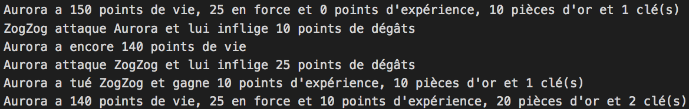

# Trop classe, la POO !

## TL;DR : en résumé

* La programmation orientée objet, ou POO, est un paradigme de programmation qui utilise des objets contenant à la fois des données et du comportement pour créer des programmes.

* Une **classe** est une abstraction orientée objet qui modélise une idée ou un concept manipulé par un programme. Les classes offrent une syntaxe pratique pour créer des objets représentant ce concept.

* En JavaScript, une classe est définie avec le mot-clé `class`. La méthode nommée   `constructor()` appelée à la création de l'objet, permet d'initialiser cet objet en lui donnant des propriétés. À l'intérieur d'une méthode définie dans une classe, le mot-clé `this` représente l'objet sur lequel la méthode a été appelée.

```js
class MaClasse {
  constructor(param1, param2 /* ... */) {
    this.propriete1 = param1;
    this.propriete2 = param2;
    // ...
  }

  methode1(/* ... */) {
    // ...
  }

  methode2(/* ... */) {
    // ...
  }

  // ...
}
```

* Les objets sont crées à partir d'une classe à l'aide du mot-clé `new`. Celui-ci appelle le constructeur (la méthode `constructor()`) de la classe afin d'initialiser le nouvel objet. La création d'un objet à partir d'une classe s'appelle **l'instanciation**.

```js
const monObjet = new MaClasse(arg1, arg2, ...);
```

* Le modèle objet de JavaScript est basé sur les **prototypes**. En plus de ses propriétés particulières, tout objet JavaScript possède une propriété interne appelée prototype. Il s'agit d'un lien (on parle de **référence**) vers un autre objet. Les prototypes permettent de partager des propriétés et de déléguer du comportement entre objets.

* Lorsqu'on essaie d'accéder à une propriété qui n'existe pas dans un objet, JavaScript essaie de trouver cette propriété dans le prototype de cet objet, puis dans le prototype du prototype, etc.  On parle de recherche dans la chaîne des prototypes.

* Plusieurs possibilités existent pour créer et lier des objets grâce à leur prototype. La première est d'utiliser la méthode `Object.create()`.

```js
// Crée un objet ayant monObjetPrototype pour prototype
const monObjet = Object.create(monObjetPrototype);
```

* L'utilisation d'une classe permet également de créer des relations entre objets JavaScript. Cette  syntaxe simule le modèle objet d'autres langages de programmation comme C++, Java ou C#. Il ne s'agit cependant que de [sucre syntaxique](https://fr.wikipedia.org/wiki/Sucre_syntaxique) au-dessus du modèle spécifique de JavaScript, basé sur les prototypes.

## Contexte : un mini-jeu de rôle, version multijoueurs

Dans un précédent chapitre, nous avons créé un mini-jeu de rôle dont voici pour mémoire le code source. Ce code crée un objet `aurora` doté de quatre propriétés et d'une méthode nommée `decrire()`.

```js
const aurora = {
  nom: "Aurora",
  sante: 150,
  force: 25,
  xp: 0,

  // Renvoie la description du personnage
  decrire() {
    return `${this.nom} a ${this.sante} points de vie, ${
      this.force
    } en force et ${this.xp} points d'expérience`;
  }
};

// "Aurora a 150 points de vie, 25 en force et 0 points d'expérience"
console.log(aurora.decrire());

console.log("Aurora apprend une nouvelle compétence");
aurora.xp += 15;

// "Aurora a 150 points de vie, 25 en force et 15 points d'expérience"
console.log(aurora.decrire());
```

Pour l'enrichir, on souhaite que plusieurs personnages puissent participer. Voici donc Glacius, le compagnon d'Aurora.

```js
const glacius = {
  nom: "Glacius",
  sante: 130,
  force: 30,
  xp: 0,

  // Renvoie la description du personnage
  decrire() {
    return `${this.nom} a ${this.sante} points de vie, ${
      this.force
    } en force et ${this.xp} points d'expérience`;
  }
};
```

On remarque immédiatement que nos deux objets `aurora` et `glacius` se ressemblent énormément. Aurora et Glacius ont exactement les mêmes propriétés (nom, santé, force, capacité à se décrire) mais avec des valeurs différentes.

Vous savez maintenant que la duplication de code est potentiellement dangereuse et doit le plus souvent être évitée. Il faudrait pouvoir centraliser dans un modèle ce qui caractérise un personnage, puis créer chaque personnage sur la base de ce modèle. Comment faire ?

## JavaScript et les classes

La plupart des langages orientés objet (C++, Java, C#, etc) sont basés sur l'utilisation de classes. Une **classe** est une abstraction qui représente une idée ou un concept manipulé par le programme. Elle facilite la création d'objets ayant le même modèle et partageant ainsi données et comportement.

JavaScript permet de programmer en utilisant des classes, même si leur intégration dans le langage est récente (voir plus loin).

### Création  d'une classe

Comme notre mini-jeu de rôle met en scène des personnage, créons une classe `Personnage` pour les modéliser.

```js
class Personnage {
  constructor(nom, sante, force) {
    this.nom = nom;
    this.sante = sante;
    this.force = force;
    this.xp = 0; // Toujours 0 au début
  }

  // Renvoie la description du personnage
  decrire() {
    return `${this.nom} a ${this.sante} points de vie, ${
      this.force
    } en force et ${this.xp} points d'expérience`;
  }
}
```

Cet exemple illustre plusieurs points-clé concernant les classes

* Une classe est créée avec le mot-clé `class` suivi du nom de la classe, qui commence le plus souvent par une majuscule.

* Contrairement aux objets littéraux, on ne sépare pas les éléments définis dans une classe par des virgules.

* Comme pour les objets littéraux, le mot-clé `this` représente à l'intérieur d'une méthode l'objet sur lequel la méthode a été appelée.

* Une méthode spéciale nommée `constructor()` peut être ajoutée à la définition de la classe. Cette méthode est exécutée pendant la création d'un objet et permet d'ajouter des données à l'objet, sous la forme de propriétés.

### Utilisation d'une classe

Une fois la classe définie, on peut l'utiliser pour créer des objets. L'opération de création d'un objet à partir d'une classe s'appelle **l'instanciation**. Voici le reste de notre programme d'exemple.

```js
// ...

const aurora = new Personnage("Aurora", 150, 25);
const glacius = new Personnage("Glacius", 130, 30);

// "Aurora a 150 points de vie, 25 en force et 0 points d'expérience"
console.log(aurora.decrire());

// "Glacius a 130 points de vie, 30 en force et 0 points d'expérience"
console.log(glacius.decrire());
```

Voici la syntaxe générale pour créer une classe et l'utiliser pour instancier un objet.

```js
class MaClasse {
  constructor(param1, param2 /* ... */) {
    this.propriete1 = param1;
    this.propriete2 = param2;
    // ...
  }

  methode1(/* ... */) {
    // ...
  }

  methode2(/* ... */) {
    // ...
  }

  // ...
}

const monObjet = new MaClasse(arg1, arg2, ...);
```

## Les spécificités de JavaScript : objets et prototypes

Si vous avez déjà une expérience de la programmation dans un autre langage, il y a des chances pour que vous ayez déjà rencontré la notion de classe. Mais comme vous allez maintenant le découvrir, les classes JavaScript ont des spécificités propres à ce langage.

### Le modèle objet de JavaScript

Pour créer des relations entre objets, JavaScript utilise les prototypes. En plus de ses propriétés particulières, tout objet JavaScript possède une propriété interne appelée **prototype**. Il s'agit d'un lien (on parle de **référence**) vers un autre objet. Lorsqu'on essaie d'accéder à une propriété qui n'existe pas dans un objet, JavaScript essaie de trouver cette propriété dans le prototype de cet objet.

```js
const unObjet = { a: 2 };

// Crée unAutreObjet avec unObjet comme prototype
const unAutreObjet = Object.create(unObjet);

console.log(unAutreObjet.a); // 2
```

Dans cet exemple, l'instruction JavaScript `Object.create()` est utilisée pour créer l'objet `unAutreObjet` en lui donnant comme prototype l'objet `unObjet`. Lors de l'appel à `unAutreObjet.a`, c'est la propriété `a` de `unObjet` qui est utilisée puisque cette propriété n'existe pas dans `unAutreObjet`.

Si le prototype d'un objet ne possède pas une propriété recherchée, alors c'est dans son propre prototype que la recherche continue, jusqu'à arriver à la fin de chaîne des prototypes. Si la propriété n'a été trouvée dans aucun objet, son accès renvoie la valeur `undefined`.

```js
const unObjet = { a: 2 };

// Crée unAutreObjet avec unObjet comme prototype
const unAutreObjet = Object.create(unObjet);

// Crée encoreUnObjet avec unAutreObjet comme prototype
const encoreUnObjet = Object.create(unAutreObjet);

console.log(encoreUnObjet.a); // 2
console.log(encoreUnObjet.b); // undefined
```

Ce mode de relation entre les objets JavaScript est appelé **délégation** : un objet délègue une partie de son fonctionnement à son prototype.

### La véritable nature des classes JavaScript

Dans les langages orientés objet nativement basés sur des classes comme C++, Java ou C#, les classes sont des modèles statiques. Après l'instanciation, il n'existe aucune relation entre un objet  et sa classe.

Le modèle objet de JavaScript est basé sur les prototypes et non sur les classes. Une classe JavaScript est elle-même un objet, pas un modèle statique. "Instancier" une classe crée un nouvel objet lié à un objet prototype.

> Ce fonctionnement est spécifique à JavaScript mais finalement assez proche de celui d'autres langages comme Python, Ruby  ou Smalltalk.

La syntaxe des classes et le mot-clé `class` ont été introduites par la norme ES2015 afin de faciliter l'utilisation de JavaScript par des développeurs habitués à d'autres langages. Cependant, le modèle objet de JavaScript reste basé sur les prototypes. La syntaxe des classes est un exemple de ce qu'on appelle sucre syntaxique : une manière fonctionnellement identique mais plus conviviale d'utiliser un langage.

L'intérêt réel de cette syntaxe fait l'objet de nombreux débats dans la communauté JavaScript.

## La programmation orientée objet

Revenons à notre mini-jeu de rôle. Malgré l'ajout d'un second personnage, notre mini-jeu reste bien limité. Que lui manque-t-il ? Des ennemis à combattre, bien sûr ! Que serait un jeu de rôle sans des combats acharnés entre héros et monstres ? Ajoutons à notre mini-jeu la possibilité pour les personnages de s'affronter.

Voici comment nous allons introduire les combats dans notre jeu. Un personnage attaqué voit ses points de vie diminués de la valeur de force de l'attaquant. Si ce nombre de points de vie tombe à zéro, alors le personnage meurt. Son vainqueur reçoit un nombre fixe de 10 points d'expérience.

 L'attaque est une capacité commune à tous les personnages. Nous la modélisons donc sous la forme d'une méthode dans la classe `Personnage`.

```js
class Personnage {
  constructor(nom, sante, force) {
    this.nom = nom;
    this.sante = sante;
    this.force = force;
    this.xp = 0; // Toujours 0 au début
  }

  // Attaque une cible
  attaquer(cible) {
    if (this.sante > 0) {
      const degats = this.force;
      console.log(
        `${this.nom} attaque ${
          cible.nom
        } et lui inflige ${degats} points de dégâts`
      );

      cible.sante -= degats;

      if (cible.sante > 0) {
        console.log(`${cible.nom} a encore ${cible.sante} points de vie`);
      } else {
        cible.sante = 0;
        const bonusXP = 10;
        console.log(
          `${this.nom} a tué ${
            cible.nom
          } et gagne ${bonusXP} points d'expérience`
        );

        this.xp += bonusXP;
      }
    } else {
      console.log(
        `${this.nom} n'a plus de points de vie et ne pas pas attaquer`
      );
    }
  }

  // Renvoie la description du personnage
  decrire() {
    return `${this.nom} a ${this.sante} points de vie, ${
      this.force
    } en force et ${this.xp} points d'expérience`;
  }
}
```

Nous pouvons maintenant introduire un monstre dans le jeu et le faire combattre contre nos personnages. Voici le reste du code.

```js
// ...

const aurora = new Personnage("Aurora", 150, 25);
const glacius = new Personnage("Glacius", 130, 30);

console.log("Bienvenue dans ce jeu d'aventure ! Voici nos courageux héros :");
console.log(aurora.decrire());
console.log(glacius.decrire());

const monstre = new Personnage("ZogZog", 40, 20);
console.log(`Un affreux monstre arrive : il s'appelle ${monstre.nom}`);

monstre.attaquer(aurora);
monstre.attaquer(glacius);
aurora.attaquer(monstre);
glacius.attaquer(monstre);

"Aurora a 130 points de vie, 25 en force et 0 points d'expérience"
console.log(aurora.decrire());

"Glacius a 110 points de vie, 30 en force et 10 points d'expérience"
console.log(glacius.decrire());
```

Ce programme est un exemple de ce qu'on appelle la **programmation orientée objet**, ou POO. Il s'agit d'un [paradigme](https://fr.wikipedia.org/wiki/Paradigme_%28programmation%29) qui permet de concevoir des programmes sous la forme d'un ensemble d'objets. Chaque objet joue un rôle précis et ce sont les interactions entre les différents objets qui vont permettre au programme de réaliser les fonctionnalités attendues.

Même si elle reste très employée à l'heure actuelle, la POO n'est pas l'unique moyen de créer des programmes efficaces. Il est tout à fait possible de combiner l'utilisation d'objets et de simples fonctions au sein d'un même programme, voire de ne pas utiliser du tout d'objets !

## A vous de jouer !

### Modélisation d'un chien

Complétez le programme suivant avec la définition de la classe Chien.

```js
// TODO : ajoutez ici la définition de la classe Chien

const crockdur = new Chien("Crockdur", "mâtin de Naples", 75);
// "Crockdur est un mâtin de Naples mesurant 75 cm"
console.log(crockdur.decrire());
// "Tiens, un chat ! Crockdur aboie : Grrr ! Grrr !"
console.log(`Tiens, un chat ! ${crockdur.nom} aboie : ${crockdur.aboyer()}`);

const milou = new Chien("Milou", "fox-terrier", 26);
// "Milou est un fox-terrier mesurant 26 cm"
console.log(milou.decrire());
// "Tiens, un chat ! Milou aboie : Wouaf ! Wouaf !"
console.log(`Tiens, un chat ! ${milou.nom} aboie : ${milou.aboyer()}`);
```

### Gestion de l'inventaire des personnages

Améliorez le mini-RPG d'exemple pour ajouter la gestion de l'inventaire des personnages selon les règles métier suivantes :

* L'inventaire d'un personnage rassemble un nombre de pièces d'or ainsi qu'un nombre de clés.

* Chaque personnage débute le jeu avec 10 pièces d'or et une clé.

* L'inventaire est affiché avec la description du personnage.

* Lors des combats, l'inventaire est transféré du vaincu au vainqueur.

Voici un exemple de résultat d'exécution.



### Liste de comptes bancaires

Ecrivez un programme qui crée une classe modélisant un compte bancaire ayant les caractéristiques suivantes :

* Une propriété `titulaire`.
* Une propriété `solde` avec par défaut la valeur 0.
* Une méthode `crediter()` qui ajoute le montant (positif ou négatif) passé en paramètre au solde du compte.
* Une méthode `decrire()` qui renvoie la description du compte.

Ecrivez un programme qui crée trois comptes : l'un pour Alex, l'aute pour Clovis et le troisième pour Marco. Ces comptes sont enregistrés dans un tableau.

Ensuite, le programme ajoute 1000 au solde de chaque compte et affiche sa description.

> Les solutions des exercices sont [consultables en ligne](https://github.com/thejsway/thejsway_fr-code).
