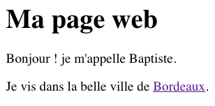

# Qu'est ce qu'un site web ?

Ce court chapitre résume ce que vous devez savoir sur le Web et les pages Web.

## TL;DR : en résumé

* Le [World Wide Web](https://en.wikipedia.org/wiki/World_Wide_Web) (ou **Web**) est un espace d'informations construit au-dessus de [Internet](https://en.wikipedia.org/wiki/Internet). Les ressources Web sont accessibles via leur [URL](https://en.wikipedia.org/wiki/Uniform_Resource_Locator) et peuvent contenir des [hyperliens](https://en.wikipedia.org/wiki/Hyperlink) vers d'autres ressources.

* Une **page Web** est un document adapté au Web. La création de pages Web implique généralement trois technologies: [HTML](https://en.wikipedia.org/wiki/HTML) pour structurer le contenu, [CSS](https://en.wikipedia.org/wiki/Cascading_Style_Sheets) à définir sa présentation et JavaScript pour ajouter de l'interactivité.

* Un document HTML est composé de texte et d'éléments structurels appelés **balises** qui décrivent le contenu de la page, tels que: paragraphes, en-têtes, liens hypertext, images, etc.

* CSS utilise des **sélecteurs** pour déclarer les éléments HTML auxquels un style s'applique. Les éléments peuvent être sélectionnés par nom de balise (`h1`), par classe (`.done`) ou par identificateur (`#rude`).

* Un document HTML peut inclure une feuille de style CSS avec une balise `<link>` et un fichier JavaScript avec une balise `<script>`.

```html
<!doctype html>
<html>

<head>
    <!-- Informations de la page: titre, encodage, etc -->

    <!-- Lien vers le fichier de style css -->
    <link href="path/to/file.css" rel="stylesheet" type="text/css">
</head>

<body>
    <!-- Contenu de la page -->

    <!-- Lien vers le fichier Javascript -->
    <script src="path/to/file.js"></script>
</body>

</html>
```

* Un **navigateur** est le logiciel que vous utilisez pour visiter des pages Web et utiliser des applications Web. Les plus modernes incluent un ensemble **d'outils de développement** pour faciliter la tâche de développement pour le Web.

## Internet et le Web

Comme vous le savez probablement, le [World Wide Web](https://en.wikipedia.org/wiki/World_Wide_Web) (ou **Web** en abrégé) est un espace d'informations en constante expansion construit au-dessus de [Internet](https://en.wikipedia.org/wiki/Internet). Les ressources Web sont accessibles via leur adresse, appelée leur [URL](https://en.wikipedia.org/wiki/Uniform_Resource_Locator), et peuvent contenir des [hyperliens](https://en.wikipedia.org/wiki/Hyperlink) à d'autres ressources. Ensemble, toutes ces ressources interconnectées forment un énorme maillage analogue à une toile d'araignée.

## Les langages du Web

Il existe trois technologies principales pour créer des pages Web: HTML, CSS et JavaScript.

### HTML

HTML, abréviation de [HyperText Markup Language](https://en.wikipedia.org/wiki/HTML), est le format de document des pages Web. Un document HTML est composé de texte et d'éléments structurels appelés **balises**. Les balises sont utilisées pour décrire le contenu de la page: paragraphes, titres, hyperliens, images, etc.

Voici un exemple de page Web simple, généralement stockée sous forme de fichier `.html`.

```html
<!doctype html>
<html>

<head>
    <meta charset="utf-8">
    <title>My web page</title>
</head>

<body>
    <h1>Ma page web</h1>
    <p>Bonjour ! je m'appelle Baptiste.</p>
    <p>Je vis dans la belle ville de <a href="https://fr.wikipedia.org/wiki/Bordeaux">Bordeaux</a>.</p>
</body>

</html>
```



Voici quelques références pour en savoir plus sur HTML:

* [Interneting is Hard - Un tutoriel de développement Web convivial pour les débutants](https://internetingishard.com/html-and-css/)
* [Khan Academy - Introduction au HTML](https://www.khanacademy.org/computing/computer-programming/html-css#intro-to-html)
* [Mozilla Developer Network - Référence HTML](https://developer.mozilla.org/en-US/docs/Web/HTML/Reference)

### CSS

CSS, ou [Feuilles de style en cascade](https://en.wikipedia.org/wiki/Cascading_Style_Sheets), est un langage utilisé pour modifier la présentation des pages Web.

CSS utilise des **sélecteurs** pour déclarer les éléments HTML auxquels un style s'applique. De nombreuses stratégies de sélection sont possibles, notamment:

* Tous les éléments d'un nom de balise donné.
* Éléments correspondant à une **classe** donnée (syntaxe du sélecteur: `.maClasse`).
* L'élément correspondant à un **identifiant** donné et unique (syntaxe du sélecteur: `#monId`).

Voici un exemple de feuille de style CSS simple, généralement stockée sous forme de fichier `.css`.

```css
/* Tous les élèments h1 seront rose */
h1 {
   color: pink;
}

/* Cette classe s'applique à tous les éléments possédant la class .done */
.done {
  text-decoration: line-through;
}

/* L'élément ayant l'id rude sera en majuscule et aura la police monospace  */
#rude {
  font-family: monospace;
  text-transform: uppercase;
}
```

Une feuille de style est associée à un document HTML à l'aide d'une balise «link» dans la partie «head» de la page.

```html
<!-- Lien vers le fichier des styles -->
<link href="path/to/file.css" rel="stylesheet" type="text/css">
```

Pour en savoir plus sur CSS, visitez les liens suivants:

* [Khan Academy - Intro to CSS](https://www.khanacademy.org/computing/computer-programming/html-css#intro-to-css)
* [Mozilla Developer Network - CSS reference](https://developer.mozilla.org/en-US/docs/Web/CSS/Reference)

### JavaScript

JavaScript peut interagir avec un document HTML pour offrir une interactivité dynamique: réponses aux actions de l'utilisateur sur la page, style dynamique, animations, etc. C'est le seul langage de programmation compris par tous les navigateurs Web.

Un fichier JavaScript, généralement stocké dans un fichier `.js`, est chargé par une page Web avec une balise `<script>`.

```html
<!-- Charger le fichier javascript -->
<script src="path/to/file.js"></script>
```

## Développement de pages Web

Pour créer des pages Web interactives, vous devez écrire du code HTML, CSS et JavaScript. Si vous débutez, le moyen le plus simple de le faire est d'utiliser un terrain de jeu JavaScript en ligne. Cependant, vous souhaiterez probablement vous développer de manière plus professionnelle à un moment donné, ou devrez travailler hors ligne.

Reportez-vous à l'annexe pour plus de détails sur la configuration de votre environnement.

## A vous de jouer !

Vous pouvez sauter cet exercice si vous avez une expérience préalable avec HTML et CSS.

### Votre première page Web

Suivez le début du didacticiel [Premiers pas avec le Web](https://developer.mozilla.org/en-US/docs/Learn/Getting_started_with_the_web) de Mozilla Developer Network pour créer une page Web simple en utilisant HTML et CSS. Les étapes requises sont:

1. [À quoi ressemblera votre site Web?](Https://developer.mozilla.org/en-US/docs/Learn/Getting_started_with_the_web/What_will_your_website_look_like)
1. [Gestion des fichiers](https://developer.mozilla.org/en-US/docs/Learn/Getting_started_with_the_web/Dealing_with_files)
1. [Bases du HTML](https://developer.mozilla.org/en-US/docs/Learn/Getting_started_with_the_web/HTML_basics)
1. [Bases de CSS](https://developer.mozilla.org/en-US/docs/Learn/Getting_started_with_the_web/CSS_basics)


